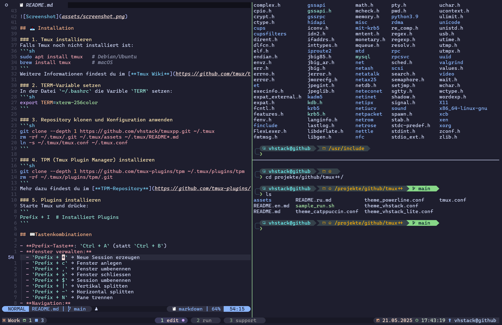

<p align="right">
  <a href="README.md"></a>  
  <a href="README.en.md"></a>  
  <a href="README.ru.md"></a>
</p>

# Tmux Konfiguration

Diese Tmux-Konfiguration optimiert die Bedienung durch nützliche Tastenkombinationen, True-Color-Support und verschiedene Plugins.
Das Beispielskript `sample_run.sh` konfiguriert und startet automatisch eine Session mit mehreren Fenstern.  



## 📥 Installation

### 1. Tmux installieren
Falls Tmux noch nicht installiert ist:
```sh
sudo apt install tmux   # Debian/Ubuntu
brew install tmux       # macOS
```

### 2. TERM-Variable setzen
In der Datei `~/.bashrc` die Varible `TERM` setzen:
```sh
export TERM=xterm-256color
```

### 3. Repository klonen und Konfiguration anwenden
```sh
git clone --depth 1 https://github.com/vhstack/tmuxpp.git ~/.tmux
rm -rf ~/.tmux/.git ~/.tmux/assets ~/.tmux/README*.md
ln -s ~/.tmux/tmux.conf ~/.tmux.conf 
```

### 4. TPM (Tmux Plugin Manager) installieren
```sh
git clone --depth 1 https://github.com/tmux-plugins/tpm ~/.tmux/plugins/tpm
rm -rf ~/.tmux/plugins/tpm/.git
```

### 5. Plugins installieren
Starte Tmux und drücke:
```
Prefix + I  # Installiert Plugins
```

## ⌨ Tastenkombinationen

- **Prefix-Taste**: `Ctrl + A` (statt `Ctrl + B`)
- **Fenster verwalten:**
  - `Prefix + c` → Fenster anlegen
  - `Prefix + ,` → Fenster umbenennen
  - `Prefix + x` → Fenster schliessen
  - `Prefix + $` → Session umbenennen
  - `Prefix + |` → Vertikal splitten
  - `Prefix + -` → Horizontal splitten
  - `Prefix + N` → Pane trennen
- **Navigation:**
  - `Prefix + ←,→,↑,↓` → Zwischen Panes wechseln
  - `Alt + →` / `Alt + ←` → Zwischen Fenstern wechseln
  - `Strg + Alt + →` / `Strg + Alt + ←` → Fenster verschieben
- **Fenstergröße anpassen:**
  - `Prefix + j/k/h/l` → Fenstergröße ändern
  - `Prefix + m` → Maximieren/Wiederherstellen
- **Konfiguration neu laden:**
  - `Prefix + r`

## 📦 Plugins
Folgende Plugins werden über TPM verwaltet:
- `tmux-plugins/tmux-sensible` → Standardkonfiguration
- `christoomey/vim-tmux-navigator` → Vim-ähnliche Navigation
- `tmux-plugins/tmux-sessionist` → Session-Management
    
## 🎨 Farbe & Theme
- True Color aktiviert
- `vhstack`-Theme aktiviert
- `catppuccin`-Theme integriert

---
Jetzt kannst du deine Tmux-Session effizienter nutzen! 🚀
