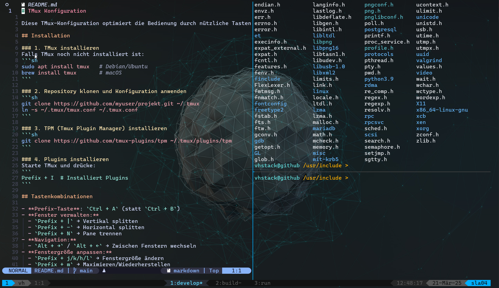

# TMux Konfiguration

Diese TMux-Konfiguration optimiert die Bedienung durch nützliche Tastenkombinationen, True-Color-Support und verschiedene Plugins.


## 📥 Installation

### 1. TMux installieren
Falls TMux noch nicht installiert ist:
```sh
sudo apt install tmux   # Debian/Ubuntu
brew install tmux       # macOS
```

### 2. Repository klonen und Konfiguration anwenden
```sh
git clone https://github.com/vhstack/tmuxpp.git ~/.tmux
ln -s ~/.tmux/tmux.conf ~/.tmux.conf
```

### 3. TPM (Tmux Plugin Manager) installieren
```sh
git clone https://github.com/tmux-plugins/tpm ~/.tmux/plugins/tpm
```

### 4. Plugins installieren
Starte TMux und drücke:
```
Prefix + I  # Installiert Plugins
```

## ⌨ Tastenkombinationen

- **Prefix-Taste**: `Ctrl + A` (statt `Ctrl + B`)
- **Fenster verwalten:**
  - `Prefix + c` → Fenster anlegen
  - `Prefix + ,` → Fenster umbenenne
  - `Prefix + |` → Vertikal splitten
  - `Prefix + -` → Horizontal splitten
  - `Prefix + N` → Pane trennen
- **Navigation:**
  - `Alt + →` / `Alt + ←` → Zwischen Fenstern wechseln
- **Fenstergröße anpassen:**
  - `Prefix + j/k/h/l` → Fenstergröße ändern
  - `Prefix + m` → Maximieren/Wiederherstellen
- **Konfiguration neu laden:**
  - `Prefix + r`

## 📦 Plugins
Folgende Plugins werden über TPM verwaltet:
- `tmux-plugins/tmux-sensible` → Standardkonfiguration
- `christoomey/vim-tmux-navigator` → Vim-ähnliche Navigation
- `tmux-plugins/tmux-sessionist` → Session-Management
- `jimeh/tmux-themepack` → Powerline-Theme
    
## 🎨 Farbe & Theme
- True Color aktiviert
- `catppuccin`-Theme vorbereitet (deaktiviert, kann aktiviert werden)
- Powerline-Doppel-Cyan-Theme standardmäßig aktiv

---
Jetzt kannst du deine TMux-Session effizienter nutzen! 🚀
