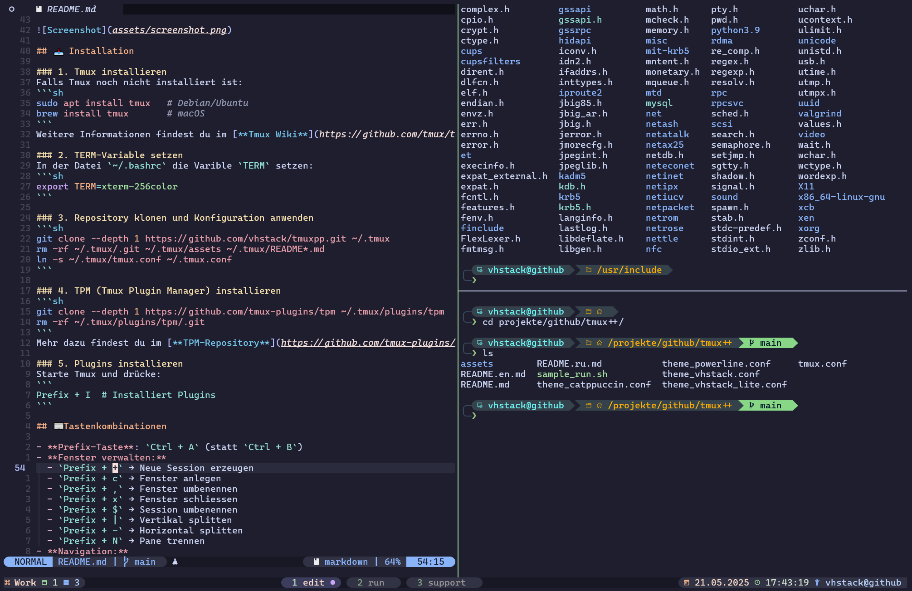

<p align="right">
  <a href="README.md"></a>  
  <a href="README.en.md"></a>  
  <a href="README.ru.md"></a>
</p>

# Tmux Konfiguration

Diese Tmux-Konfiguration optimiert die Bedienung durch nützliche Tastenkombinationen, True-Color-Support, Maus- und Zwischenablage-Unterstützung sowie verschiedene Plugins.
Das Beispielskript `sample_run.sh` konfiguriert und startet automatisch eine Session mit mehreren Fenstern.  



## 📥 Installation

### 1. Tmux installieren
Falls Tmux noch nicht installiert ist:
```sh
sudo apt install tmux   # Debian/Ubuntu
brew install tmux       # macOS
```
Weitere Informationen findest du im [**Tmux Wiki**](https://github.com/tmux/tmux/wiki).

### 2. TERM-Variable setzen
In der Datei `~/.bashrc` die Varible `TERM` setzen:
```sh
export TERM=xterm-256color
```

### 3. Repository klonen und Konfiguration anwenden
```sh
git clone --depth 1 https://github.com/vhstack/tmuxpp.git ~/.tmux
rm -rf ~/.tmux/.git ~/.tmux/assets ~/.tmux/README*.md
ln -s ~/.tmux/tmux.conf ~/.tmux.conf 
```
`clipboard.sh` bleibt dabei liegen — die Datei wird für die Zwischenablage gebraucht (siehe unten).

### 4. TPM (Tmux Plugin Manager) installieren
```sh
git clone --depth 1 https://github.com/tmux-plugins/tpm ~/.tmux/plugins/tpm
rm -rf ~/.tmux/plugins/tpm/.git
```
Mehr dazu findest du im [**TPM-Repository**](https://github.com/tmux-plugins/tpm).

### 5. Plugins installieren
Starte Tmux und drücke:
```
Prefix + I  # Installiert Plugins
```

## ⌨ Tastenkombinationen

- **Prefix-Taste**: `Ctrl + A` (statt `Ctrl + B`)
- **Fenster & Panes:**
  - `Prefix + +` → Neue Session erzeugen
  - `Prefix + c` → Fenster anlegen
  - `Prefix + ,` → Fenster umbenennen
  - `Prefix + $` → Session umbenennen
  - `Prefix + |` → Senkrecht teilen (Panes nebeneinander)
  - `Prefix + -` → Waagerecht teilen (Panes untereinander)
  - `Prefix + b` → Pane in ein eigenes Fenster lösen
  - `Prefix + x` → Pane schliessen
  - `Prefix + &` → Fenster schliessen
  - `Prefix + s` → Session-Baum, nach Namen sortiert
- **Navigation:**
  - `Prefix + ←,→,↑,↓` → Zwischen Panes wechseln
  - `Alt + →` / `Alt + ←` → Zwischen Fenstern wechseln
  - `Strg + Alt + →` / `Strg + Alt + ←` → Fenster verschieben
- **Fenstergröße anpassen:**
  - `Prefix + j/k/h/l` → Fenstergröße ändern (wiederholbar)
  - `Prefix + z` → Pane maximieren/wiederherstellen
- **Maus:**
  - Mausrad → Im History-Buffer scrollen (3 Zeilen pro Rasterung, der Copy-Mode wird automatisch betreten und am Ende wieder verlassen)
  - Ziehen → Markieren, beim Loslassen in die Zwischenablage kopieren
  - Doppelklick / Dreifachklick → Wort / Zeile kopieren
  - Rechtsklick → Aus der Zwischenablage einfügen
  - `Prefix + m` → Maussteuerung an/aus
  - `Prefix + >` oder `Alt + Rechtsklick` → Kontextmenü des Panes
- **Copy-Mode (vi-Tasten):**
  - `Strg + PageUp` oder `Prefix + [` → Copy-Mode starten
  - `v` → Auswahl beginnen, `y` → Kopieren, `q` → Verlassen
  - `Prefix + ]` → Aus dem tmux-Buffer einfügen
  - Verlauf: 50 000 Zeilen pro Pane
- **Konfiguration neu laden:**
  - `Prefix + r`

## 📋 Zwischenablage
`clipboard.sh` verbindet tmux mit der Zwischenablage des Systems. Die Datei muss neben der `tmux.conf` liegen (der Pfad wird beim Laden ermittelt, `~/.tmux/clipboard.sh` ist die Voreinstellung). Das passende Werkzeug wird automatisch erkannt:

| Plattform | Werkzeug | Installation |
| --- | --- | --- |
| WSL / Windows | `clip.exe`, `powershell.exe` (optional `win32yank.exe`) | bereits vorhanden |
| macOS | `pbcopy` / `pbpaste` | bereits vorhanden |
| Linux (Wayland) | `wl-copy` / `wl-paste` | `sudo apt install wl-clipboard` |
| Linux (X11) | `xclip` oder `xsel` | `sudo apt install xclip` |

Beim Kopieren geht der Text zusätzlich per OSC 52 an das Terminal, an dem man sitzt. Dieser Weg braucht kein Werkzeug auf dem Rechner und funktioniert deshalb auch auf einem Server ohne X/Wayland und über SSH hinweg — vorausgesetzt, das Terminal unterstützt OSC 52 (Windows Terminal, WezTerm, kitty, iTerm2, Alacritty).
Beim Einfügen geht das nicht: OSC 52 darf aus Sicherheitsgründen nur schreiben, nicht lesen. Ohne lokales Werkzeug fügt der Rechtsklick deshalb den tmux-eigenen Buffer ein — also genau das, was zuletzt in tmux markiert wurde. `Prefix + ]` tut dasselbe.
Für die native Auswahl des Terminals, etwa über mehrere Panes hinweg, beim Ziehen `Shift` halten oder die Maus mit `Prefix + m` abschalten.

## 📦 Plugins
Folgende Plugins werden über TPM verwaltet:
- `christoomey/vim-tmux-navigator` → Vim-ähnliche Navigation
- `tmux-plugins/tmux-sessionist` → Session-Management
    
## 🎨 Farbe & Theme
- True Color aktiviert
- Auswählbare Themes (über `@theme` in `tmux.conf`): `vhstack`, `vhstack_lite`, `catppuccin`
- `vhstack`-Theme standardmäßig aktiviert

---
Jetzt kannst du deine Tmux-Session effizienter nutzen! 🚀
